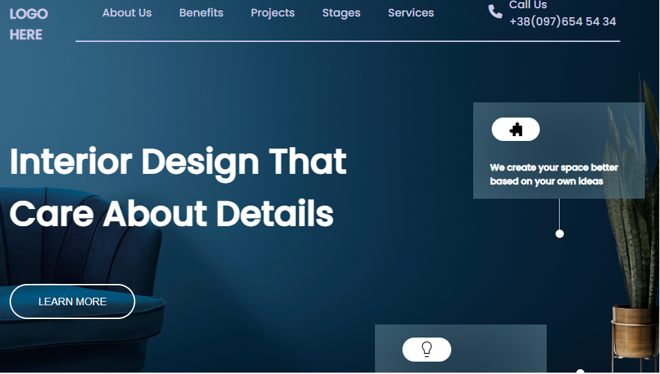

## Live Class Project 10

# Interior Design Landing Page

### Concepts Learnt

- How to write html code.
- Getting and using required images and icons properly.
- How to make horizontal line after or before the element using pseudo elements
- making the webpages responsive.

Time taken to finish this home page is 1 day.

[netlify link](https://live-project-interior-homepage.netlify.app/)

